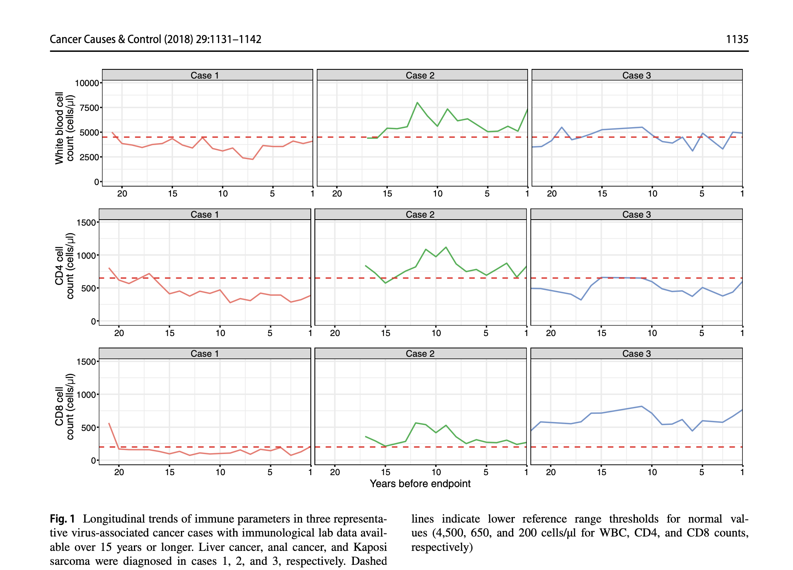
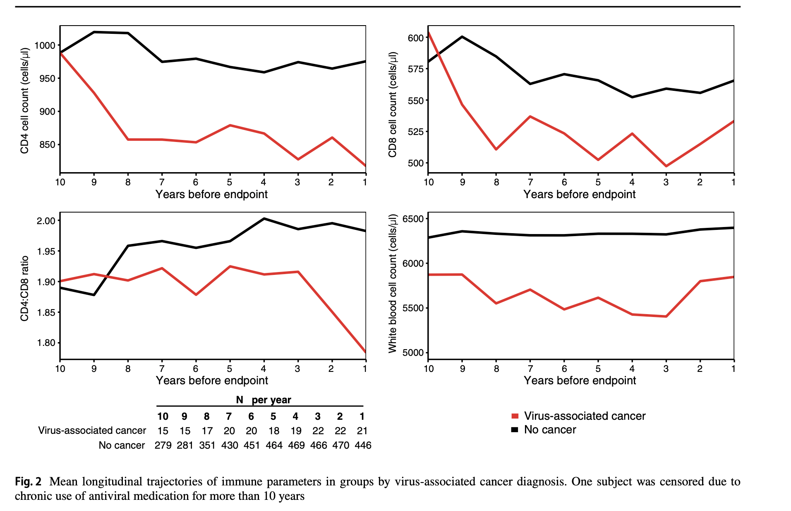
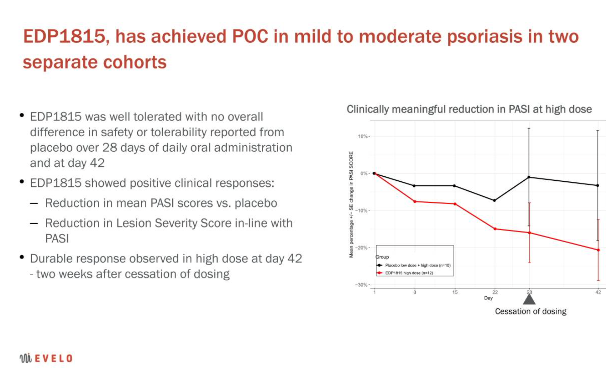
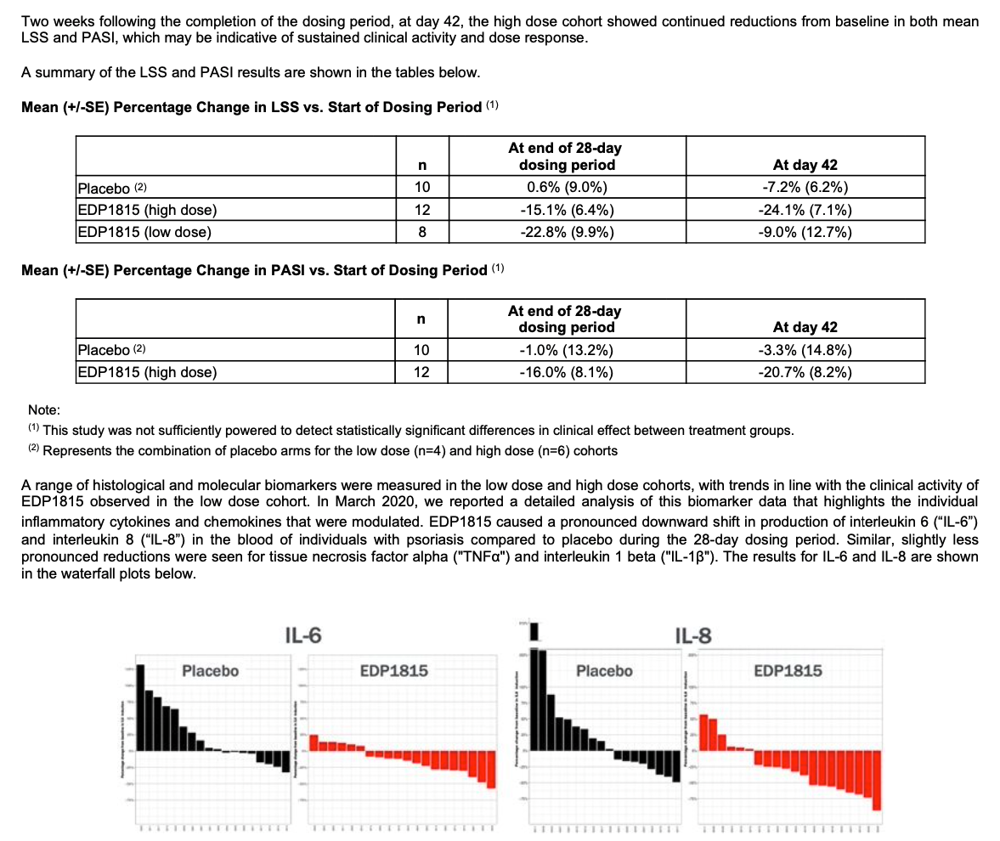
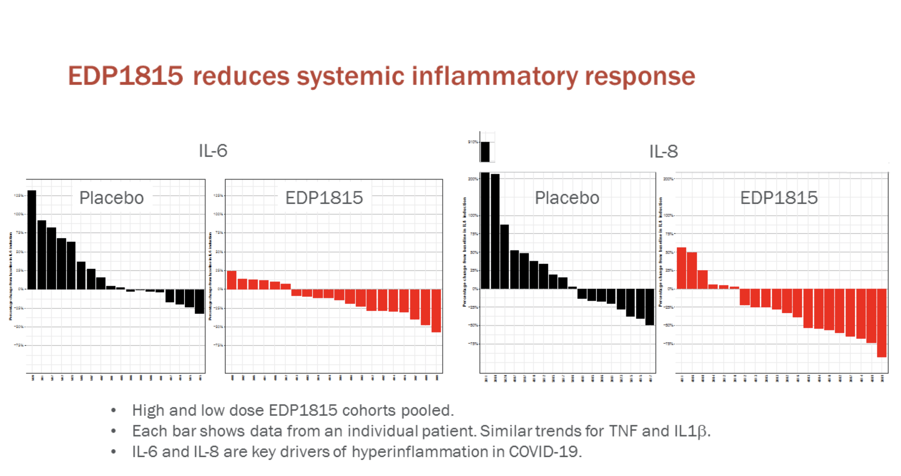
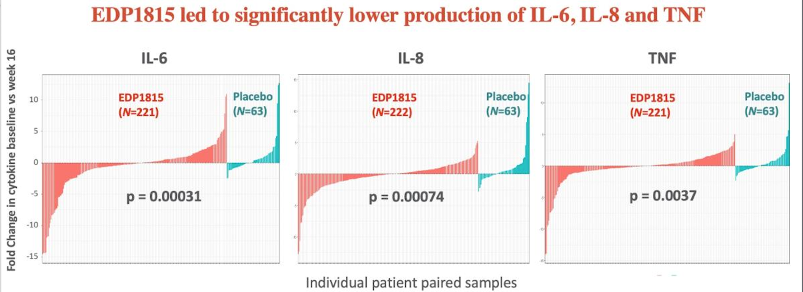

# Quantitative Scientist|Data Scientist|Computational biologist

## Education

Ph.D., Biochemistry| Brown University
B.A., Genetics and Molecular Biology|Rugers University

## Linkedin

<a href="https://www.linkedin.com/in/anupriya-dutta-50796a12a/">LinkedIn profile</a>

## Select publications and figures

<a href="https://journals.lww.com/aidsonline/fulltext/2014/07170/cerebrospinal_fluid_metabolomics_reveals_altered.4.aspx" style="font-size: 25px; text-decoration: none">Cerebrospinal fluid metabolomics reveals altered waste clearance and accelerated aging in HIV patients with neurocognitive impairment</a>

Cassol E, Misra V, **Dutta, A.**, Morgello S, Gabuzda D. 

Objective(s): HIV-associated neurocognitive disorders (HAND) remain prevalent in HIV-infected patients on antiretroviral therapy (ART), but the underlying mechanisms are unclear. Some features of HAND resemble those of age-associated cognitive decline in the absence of HIV, suggesting that overlapping mechanisms may contribute to neurocognitive impairment.
Design: Cross-sectional analysis of cerebrospinal fluid (CSF) from 100 individuals (46 HIV-positive patients and 54 HIV-negative controls).
Methods: Untargeted CSF metabolite profiling was performed using liquid/gas chromatography followed by mass spectrometry. Cytokine profiling was performed by Bioplex. Bioinformatic analyses were performed in Metaboanalyst and R.
Results: Alterations in the CSF metabolome of HIV patients on ART mapped to path- ways associated with neurotransmitter production, mitochondrial function, oxidative stress, and metabolic waste. Many CSF metabolites altered in HIV overlapped with those altered with advanced age in HIV-negative controls, suggesting a pattern indicative of accelerated aging. Machine learning models identified neurotransmitters (glutamate, N-acetylaspartate), markers of glial activation (myo-inositol), and ketone bodies (beta- hydroxybutyric acid, 1,2-propanediol) as top-ranked classifiers of HAND. These CSF metabolites correlated with worse neurocognitive test scores, plasma inflammatory biomarkers [interferon (IFN)-a, IFN-g, interleukin (IL)-8, IL-1b, IL-6, IL-2Ra], and intrathe- cal IFN responses (IFN-g and kynurenine : tryptophan ratio), suggesting inter-relationships between systemic and intrathecal inflammation and metabolic alterations in CSF.
Conclusions: Alterations in the CSF metabolome of HIV patients on ART suggest that persistent inflammation, glial responses, glutamate neurotoxicity, and altered brain waste disposal systems contribute to mechanisms involved in HAND that may be augmented with aging. 

### Select figures

<td></td>  
  

<td></td> 

  

<a href="https://www.ncbi.nlm.nih.gov/pmc/articles/PMC5414542/pdf/aids-31-1169.pdf" style="font-size: 25px; text-decoration: none">Long-term nitrite inhalant exposure and cancer risk in MSM</a>

**Dutta, A.**, Uno, H., Holman, A.G., Lorenz, D.R., Wolinsky, S., & Gabuzda, D.

Abstract
Objectives: Nitrite inhalants (poppers) are commonly used recreational drugs among MSM and were previously associated with elevated rates of high-risk sexual behavior, HIV and human herpesvirus type 8 (HHV-8) seroconversion, and transient immuno- suppressive effects in experimental models. Whether long-term popper use is associated with cancer risk among MSM in the HAART era is unclear.
Design: Prospective cohort study of cancer risk in 3223 HIV-infected and uninfected MSM in the Multicenter AIDS Cohort Study from 1996–2010.
Methods: Poisson regression models were used to examine the association between heavy popper use (defined as daily or weekly use for at least 1 year) and risk of individual cancers or composite category of virus-associated cancers.
Results: Among all participants, heavy popper use was not associated with increased risk of any individual cancers. Among HIV-uninfected men aged 50–70, heavy popper use was associated with increased risk of virus-associated cancer with causes linked to human papillomavirus, HHV-8, and Epstein–Barr virus in models adjusted for demo- graphics, number of sexual partners, immunological parameters (CD4þ cell counts or CD4þ/CD8þ ratios), and hepatitis B and C viruses [incidence rate ratio (IRR), 95% confidence interval (CI) 3.24, 1.05–9.96], or sexually transmitted infections (IRR 3.03, 95% CI, 1.01–9.09), as was cumulative use over a 5-year period (IRR 1.012, 95% CI 1.003–1.021; P1⁄40.007). There was no significant association between heavy popper use and virus-associated cancer in HIV-infected men.
Conclusions: Long-term heavy popper use is associated with elevated risk of some virus-associated cancers with causes related to human papillomavirus, HHV-8, and Epstein–Barr virus infections in older HIV-uninfected MSM independent of sexual behavior and immunological parameters.

<a href="https://pubmed.ncbi.nlm.nih.gov/28451806/" style="font-size: 25px; text-decoration: none">Racial differences in prostate cancer risk in young HIV-positive and HIV-negative men: a prospective cohort study</a>

**Dutta, A.**, Uno H, Holman A, Lorenz DR, Gabuzda D.

Abstract
Purpose: African American men have the highest incidence of prostate cancer among ethnic groups, and racial disparity is highest in younger men. Prostate cancer prevalence is rising in HIV-infected men due to improved survival on antiretroviral therapies, yet little is known about racial differences in prostate cancer risk by HIV-infection status and age.

Methods: This is a prospective cohort study of prostate cancer risk in 2,800 HIV-infected and -uninfected men who have sex with men (MSM) aged 40-70 years (22% African American) who were enrolled in the multicenter AIDS cohort study from 1996 to 2010. Poisson regression models were used to examine associations between race and HIV-infection status and prostate cancer risk among men aged 40-70, 40-55, and 56-70 years.

Results: Among men aged 40-70 years, incidence rates (IR) per 100,000 person-years were 169 among all men and 276 among African American HIV-infected men. Prostate cancer risk was similar by HIV-infection status (IRR 1.0, 95% CI 0.55-1.82), but nearly threefold higher in African Americans compared to non-African Americans in adjusted models (IRRs 2.66 and 3.22, 95% CIs 1.36-5.18 and 1.27-8.16 for all or HIV-infected men, respectively). Racial disparity in prostate cancer risk was greatest in African American men aged 40-55 years (adjusted IRR 3.31, 95% CI 1.19-9.22). Prostate cancer risk showed associations with family history of prostate cancer (p = 0.001), but not heavy smoking, androgen supplement use, or HIV-related factors.

Conclusions: Among MSM, African American HIV-positive and HIV-negative men aged 40-55 years have threefold increased risk of young-onset prostate cancer compared to non-African American men, highlighting the need to make informed decisions about screening in this population.

<a href="https://www.ncbi.nlm.nih.gov/pmc/articles/PMC5414542/pdf/aids-31-1169.pdf" style="font-size: 25px; text-decoration: none">Low T-cell subsets prior to development of virus-associated cancer in HIV-seronegative men who have sex with men</a>

**Dutta, A.**, Uno, H., Lorenz, D.R., Wolinsky, S., & Gabuzda, D.

Abstract
Immunological parameters that influence susceptibility to virus-associated cancers in HIV-seronegative individuals are unclear. We conducted a case–control cohort study of immunological parameters associated with development of incident virus-associated cancers among 532 HIV-seronegative men who have sex with men (MSM) enrolled in the Multicenter AIDS Cohort Study (MACS) with median (IQR) 21 (8–26) years of follow-up. Thirty-two incident virus-associated cancers (anal cancer, non-Hodgkin lymphoma, liver cancer, other cancers with etiologies linked to human papillomavirus, Epstein–Barr virus, hepatitis B virus, or human herpesvirus-8) were identified among 3,408 HIV-seronegative men in the MACS during 1984–2010. Cases were matched for demographics, smoking, and follow-up to 500 controls without cancer. Mixed-effects and Cox regression models were used to examine associations between nadir or recent CD4, CD8, and white blood cell (WBC) counts or CD4:CD8 ratios and subsequent diagnosis of virus-associated cancers. Men with incident virus-associated cancers had lower CD4 and WBC counts over a 6-year window prior to diagnosis compared to men without cancer (p = 0.001 and 0.03, respectively). Low CD4 cell count and nadir, CD4 count-nadir differential, and CD4:CD8 ratio nadir were associated with increased 2-year risk of incident virus-associated cancers in models adjusted for demographics and smoking (hazard ratios 1.2–1.3 per 100 or 0.1 unit decrease, respectively; p < 0.01). Other associated factors included heavy smoking and past or current hepatitis B virus infection. These findings show that low CD4 cell counts, CD4 nadir, and CD4:CD8 cell ratios are independent predictors for subsequent risk of virus-associated cancers in HIV-seronegative MSM.

### Select figures

<td></td>  

  

<td></td>

  

<a href="https://www.ncbi.nlm.nih.gov/pmc/articles/PMC5850013/" style="font-size: 25px; text-decoration: none">Marijuana Use Impacts Midlife Cardiovascular Events in HIV-Infected Men</a>

Lorenz, D.R., **Dutta, A.**, Mukerji, S.S., Holman, A.G., Uno, H., & Gabuzda, D. 

Abstract
Background

Marijuana use is prevalent among persons infected with human immunodeficiency virus (HIV), but its long-term effects on HIV disease progression and comorbidities are unknown.
Methods

In this prospective study of 558 HIV-infected men enrolled in the Multicenter AIDS Cohort Study between 1990 and 2010, there were 182 HIV seroconverters and 376 with viral suppression on combination antiretroviral therapy (ART). Associations between heavy marijuana use and HIV disease markers or white blood cell (WBC) count were examined using mixed-effects and linear regression models. Effects of marijuana use on cardiovascular (CV) events and other endpoints were estimated using Kaplan-Meier and logistic regression analyses.
Results

The median baseline age of participants was 41, 66% were white, 79% had education >12 years, and 20% reported heavy marijuana use at ≥50% of biannual visits during follow-up. Long-term heavy marijuana use showed no significant associations with viral load, CD4 counts, AIDS, cancer, or mortality in both cohorts but was independently associated with increased CV events between ages 40–60 after adjusting for age, tobacco smoking, viral load, and traditional risk factors (odds ratio [OR], 2.5; 95% confidence interval [CI] 1.3, 5.1). Marijuana and tobacco use were each independently associated with higher WBC counts in adjusted models (P < .01); the highest quartile of WBC counts (≥6500 cells/µL) was associated with increased CV events (OR 4.3; 95% CI, 1.5, 12.9).
Conclusions

Heavy marijuana use is a risk factor for CV disease in HIV-infected men ages 40–60, independent of tobacco smoking and traditional risk factors.

## Published analysis and visualizations from early phase clinical studies

Working with subject matter experts and stakeholders, the following trends in early phase clinical studies were identified:

<a href="https://seekingalpha.com/article/4387534-evelo-biosciences-clinical-data-coming-soon" style="font-size: 20px; text-decoration: none">Analysis of Clinical Data</a>

<td></td>

  

<a href="https://seekingalpha.com/filings/pdf/14135734" style="font-size: 20px; text-decoration: none">Analysis of Clinical and Biomarker Data in SEC filing (pg 28)</a>

<td></td>

  

<a href="https://seekingalpha.com/article/4387534-evelo-biosciences-clinical-data-coming-soon" style="font-size: 20px; text-decoration: none">Biomarker data evidence as support for initation of multiple studies for treatment of Covid-19</a>

<td></td>

  

<a href="https://finance.yahoo.com/news/evelo-biosciences-announces-highly-significant-120000093.html" style="font-size: 20px; text-decoration: none">Trends were later confirmed in a larger phase II study:</a>

<td></td>